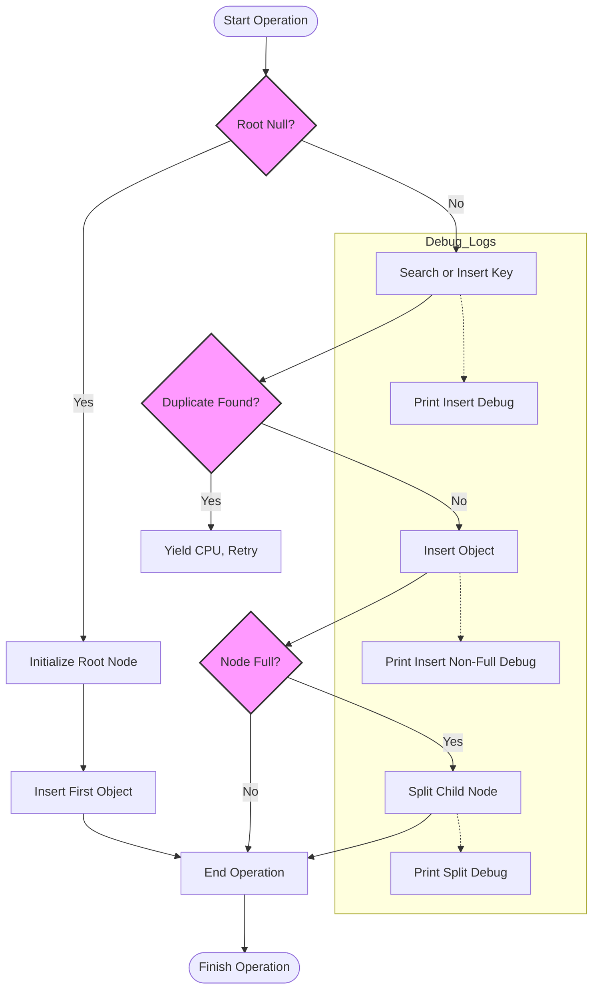

# Debugging and Optimizing BTree Performance

## Overview

This guide provides practical techniques and actionable strategies for profiling, benchmarking, and tuning the BTree implementation to achieve high-performance in demanding workloads. You will learn how to reduce bottlenecks, leverage low-level assembly optimizations, and utilize debug output effectively for troubleshooting.

This page focuses specifically on performance-related aspects and debugging outputs of the BTree internals, complementing guides on using the C interface and demo configuration.

---

## 1. Understanding the Debug Output

The BTree assembly implementation contains embedded debug `printf` statements at strategic points within critical functions to aid in tracing and debugging operations such as insertion, deletion, searching, and tree traversal.

### How Debug Logging Works:

- Each core routine prints a header message indicating the current operation (e.g., `---| b_insert |---`).
- Callback comparisons (`o_cmp_cb`, `k_cmp_cb`) print detailed value comparisons.
- Tree walking and object printing routines output index and data for verification.

This debug output enables real-time visibility into BTree behavior, helping identify performance hotspots and logic issues.

### Activating or Suppressing Debug Output:

- The debug `printf` calls can be left active for development or suppressed in production.
- In the source assembly file `btree.asm`, debug calls are enclosed in `BEGIN PRINTF` and `END PRINTF` comments.
- To improve performance in production, you can comment out or remove these blocks.

<Tip>
Disabling debug `printf` significantly reduces overhead and improves throughput by minimizing I/O blocking during tree operations.
</Tip>

---

## 2. Profiling and Benchmarking the BTree

### Purpose and Goal

Profiling helps identify slow paths and CPU bottlenecks in the BTree, especially important given the assembly-level implementation and use in high-performance environments.

Benchmarking validates the effects of tuning changes and parameter adjustments.

### Recommended Profiling Workflow

<Steps>
<Step title="Prepare the environment">
Ensure you have the BTree demo built and ready. Use the `btree_make.sh` script to build all required libraries and the demo executable.
</Step>

<Step title="Enable debug prints temporarily">
Run the demo in debug mode by default to observe detailed logs. This helps know exactly which operations are being executed.
</Step>

<Step title="Use profiling tools">
Run system profiling tools such as `perf` or `gprof` targeting the `btest` executable to identify CPU time spent inside BTree operations.
</Step>

<Step title="Analyze Results">
Focus on functions like `b_insert`, `b_delete`, `b_search`, and low-level memory moves (`memmove64`). Pay special attention to recursion depth, node splits, and fills.
</Step>

<Step title="Repeat after tuning">
Disable debug prints and rerun tests to confirm performance improvements.
</Step>
</Steps>

### Benchmark Tips

- Increase `DATA_COUNT` in `btest/main.h` to simulate higher load.
- Test with varying `MINIMUM_DEGREE` values to find the optimal balance of node size and tree height.

<Note>
Increasing `MINIMUM_DEGREE` increases the number of keys per node, reducing tree height but increasing per-node processing cost.
</Note>

---

## 3. Tuning Parameters for Performance

### Key Configuration Parameters

- `DATA_COUNT` (default 128): Number of data objects inserted in the demo.
- `DELETE_COUNT` (default 0): Number of deletions executed during the demo run.
- `MINIMUM_DEGREE` (default 15): Controls branching factor of the BTree.

These settings impact performance characteristics, memory footprint, and execution times.

### Adjusting `MINIMUM_DEGREE`

- A higher minimum degree means nodes contain more keys, decreasing tree height but increasing CPU workload per node.
- A lower minimum degree creates a taller tree with smaller nodes, which may add overhead due to more traversals.

Testing with different values gives insight into trade-offs for your workload and hardware.

### Callback Impact on Performance

Callbacks for comparisons (`o_cmp_cb`, `k_cmp_cb`), key extraction (`k_get_cb`), and deletion (`o_del_cb`) are executed frequently.

Optimize these callbacks by:

- Minimizing computation inside callbacks
- Avoiding unnecessary string formatting or I/O during comparisons in high-throughput scenarios

<Tip>
In production, replace debug-enabled callbacks with lightweight variants without `printf` calls to reduce overhead.
</Tip>

---

## 4. Leveraging Low-Level Assembly Optimizations

### Understanding Memmove64 Optimization

The BTree implementation calls `memmove64`, a highly optimized assembly routine for bulk memory moves used to shift arrays of keys and pointers efficiently.

This specialized routine leverages architecture-specific instructions to minimize CPU cycles during node splitting, merging, insertion, and deletion.

### Aligning Data Structures

- Stack and memory pointers are aligned to 16-byte boundaries before function calls, enabling faster access and SIMD instructions where possible.

- Function macros such as `ALIGN_STACK_AND_CALL` ensure ABI compliance and performance.

### Minimizing Cache Misses

- The node initialization and layout organize child pointers and keys contiguously to improve cache locality.

- The assembly code manages movement of keys and child pointers carefully during node operations to reduce CPU cache invalidations.

<Tip>
Avoid changing internal data structures unless you are confident about cache alignment and assembly code impacts.
</Tip>

---

## 5. Using Debug Output to Troubleshoot Issues

### Common Scenarios

- **Insertion anomalies:** Using debug outputs from `b_insert`, `b_split_child`, and callbacks identifies where duplicates or ordering errors occur.
- **Deletion errors:** Logs in `b_delete`, `b_delete_from_leaf`, and `b_delete_from_non_leaf` indicate if deletions succeed or fail unexpectedly.
- **Search issues:** `b_search` debug logs reveal whether keys are found correctly or not.

### How to Interpret Printf Debug Lines

- Functions output their name in the debug header.
- Comparison callbacks print values being compared with their floating-point values and string representations.
- Traversal and walk callbacks output object indices and data for validation.

### Troubleshooting Tips

- If `DELETION ERROR!` appears in the output after removing keys, recheck deletion parameters and data uniqueness.
- A proliferation of callback debug lines may indicate frequent duplicate searches or inefficient comparisons.

<Warning>
Excessive debug output slows down operations and may mask performance bottlenecks.
</Warning>

---

## 6. Best Practices for High-Performance Workloads

- **Disable debug `printf` in production** to avoid overhead.
- **Tune `MINIMUM_DEGREE`** according to your memory availability and key distribution.
- **Use efficient, dry callbacks** without heavy formatting or I/O.
- **Batch insertions and deletions** where possible to reduce tree rebalancing costs.
- **Profile iteratively** after each tuning step using system profilers.

---

## 7. Summary Diagram: BTree Operation Flow with Debug

---

## 8. Troubleshooting Common Performance Pitfalls

<AccordionGroup title="Troubleshooting Performance and Debugging Issues">
<Accordion title="Excessive Debug Output Slowing Execution">
Debug `printf` calls produce heavy console output, significantly slowing down insertions and deletions in the demo. Solution: Comment out or remove debug print blocks marked by `BEGIN PRINTF` and `END PRINTF` in `btree.asm`.
</Accordion>

<Accordion title="Duplicate Keys Causing Insertion Delays">
Repeated attempts to insert duplicate keys cause CPU yielding and retries. Check your random seed and data generation logic in the demo program (`btest/main.c`) to ensure unique keys.
</Accordion>

<Accordion title="Inefficient Callbacks Affecting Performance">
Verbose or computation-heavy callbacks reduce throughput. Optimize comparison and deletion callbacks by removing unnecessary string formatting or I/O during runtime.
</Accordion>

<Accordion title="Memory Fragmentation or Slow Allocation">
Dynamic node allocation happens via `calloc` in assembly. Running on memory-constrained or fragmented systems can increase latency. Use system monitoring tools to verify.
</Accordion>
</AccordionGroup>

---

## 9. Next Steps & Additional Resources

- Explore the [Using the BTree C Interface](guides/core-workflows/using-btree-c-interface) guide to understand the API layer clearly.
- Review [Customizing Demo Parameters](guides/core-workflows/customizing-demo-parameters) for tuning the demo behavior further.
- Consult the [BTree Best Practices and Patterns](guides/real-world-usage-optimization/btree-best-practices) guide for advanced usage and callback design.
- Visit the project [GitHub Repository](https://github.com/KatoKode/BTree) for source, issues, and updates.

---

## Source Links

For deeper exploration, view the full source code and debug print sections in:

- Assembly Core: [`btree/btree.asm`](https://github.com/KatoKode/BTree/blob/main/btree/btree.asm)
- Demo Program: [`btest/main.c`](https://github.com/KatoKode/BTree/blob/main/btest/main.c)
- Callbacks and Config: [`btest/main.h`](https://github.com/KatoKode/BTree/blob/main/btest/main.h)

---