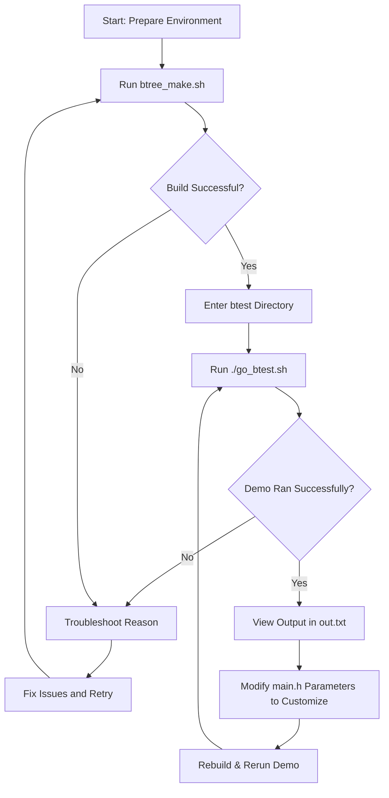

# Building & Running the Demo

## Quickly Compile and Experience the BTree Demo

This guide walks you through compiling the BTree project and running the included demo program for the first time. Designed for rapid validation, it helps you confirm that your environment is correctly set up and that the demo runs as expected. Along the way, you will learn about customizable parameters and essential behaviors that tailor the demo to your needs.

---

## What You Will Achieve

- Compile the BTree libraries and demo program seamlessly using the provided script.
- Run the demo program, supplying a random seed to generate data.
- Observe the demo's output to verify the correct insertion, search, and deletion of BTree data.
- Modify key parameters to experiment with data volume and delete operations.

---

## Prerequisites

Before proceeding, ensure you have:

- A Linux environment with command-line access.
- Installed the NASM assembler, GCC compiler, and make utility.
- Cloned or downloaded the BTree project repository.

Refer to the [System Requirements](../getting-started/requirements-installation/system-prerequisites) page for detailed prerequisites.

---

## Step 1: Compile the Demo and Libraries

The project provides a comprehensive shell script, `btree_make.sh`, that automates the build process for the utility library, the BTree core, and the demo application.

### How to Run the Build Script

Open a terminal at the root of the BTree project and enter:

```bash
sh ./btree_make.sh
```

This script will:

- Clean and build `libutil.so` from the utilities folder.
- Build `libbtree.so` from the core BTree source.
- Build the `btest` demo program.
- Set the appropriate executable permissions on the demo run script `go_btest.sh`.

Successful completion will display confirmation messages separated by separators for clarity.

<Tip>
If any errors occur, ensure you have the required build tools installed and that your environment variables are set correctly.
</Tip>

---

## Step 2: Run the Demo Program

Navigate to the `btest` directory:

```bash
cd btest
```

Run the demo using the helper script to generate and execute the demo with a random seed:

```bash
./go_btest.sh
```

### What Happens During the Demo

- The script generates a random seed number.
- The demo program `btest` runs with this seed, initializing the random number generator.
- It creates unique data entries, inserts them into the BTree, and walks through the tree printing the stored data.
- Optional deletion steps remove entries and verify their removal.
- The program outputs its results to `out.txt`.
- After execution, you'll be prompted to view `out.txt` using `less`.

<Tip>
If you want to run the demo manually without the script, use:

```bash
./btest <random_seed>
```

where `<random_seed>` is any positive integer.
</Tip>

---

## Step 3: Customize Demo Behavior

The demo program provides two key parameters you can adjust by editing `main.h` before compilation:

```c
#define DATA_COUNT    128  // Number of random data entries to insert
#define DELETE_COUNT  0    // Number of entries to delete after insertion
```

- **DATA_COUNT** controls the amount of data generated and inserted into the tree.
- **DELETE_COUNT** controls how many entries get deleted after insertion and walking.

<Tip>
Be cautious: the demo does not validate if `DELETE_COUNT` exceeds `DATA_COUNT`. Keep `DELETE_COUNT` ≤ `DATA_COUNT`.
</Tip>

---

## Understanding the Demo Flow

The demo demonstrates typical interactions with a BTree:

- **Initialization:** Allocating and setting up the BTree structure.
- **Insertion:** Inserting unique random floating-point data entries while checking for duplicates.
- **Search:** Searching the BTree for existing keys to test lookup.
- **Traversal:** Walking the tree and printing stored data in order.
- **Deletion:** Optionally deleting entries and confirming their removal.
- **Cleanup:** Properly terminating the BTree and freeing allocated memory.

### Code Snippet: Main Loop Insertion

```c
for (size_t i = 0L; i < DATA_COUNT; ++i) {
  data_t d;
  do {
    d.d = generate_random_double();
  } while (b_search(tree->root, &d.d, &db) != NULL); // avoid duplicates
  b_insert(tree, &d);
}
```

This loop ensures only unique random values go into the BTree, showcasing realistic usage scenarios.

---

## Troubleshooting Common Issues

<AccordionGroup title="Demo Runtime Issues">
<Accordion title="Compilation Failures">
Ensure NASM, GCC, and make are installed and executable from your PATH. Verify you have permissions to run scripts.
</Accordion>
<Accordion title="Demo Doesn't Produce Output or Crashes">
Check if you provided a valid positive integer argument when running `btest` manually. Use `./go_btest.sh` to avoid manual errors.
</Accordion>
<Accordion title="Invalid DELETE_COUNT Value">
If more deletions than insertions occur, the demo may behave unexpectedly. Always maintain `DELETE_COUNT` ≤ `DATA_COUNT`.
</Accordion>
</AccordionGroup>

---

## Next Steps

Once you have successfully built and run the demo, deepen your understanding by exploring:

- [Using the BTree C Interface](../guides/core-workflows/using-btree-c-interface) to learn programmatic integration.
- [Project Architecture](../overview/architecture-quickstart/system-architecture) to visualize internal components.
- [BTree Best Practices and Patterns](../guides/real-world-usage-optimization/btree-best-practices) for real-world optimization.

These will help transition from demo use to leveraging the BTree library in your own projects.

---

## Additional Resources

- View the project repository: [BTree on GitHub](https://github.com/KatoKode/BTree)
- Learn about BTree fundamentals: [What is the BTree Project?](../overview/intro-value/product-summary)


---

## Summary Flow Diagram



This diagram outlines the user workflow from setup to observing results and customizing for further experimentation.

---

Enjoy exploring the efficient, assembly-powered BTree implementation through this hands-on demo!
