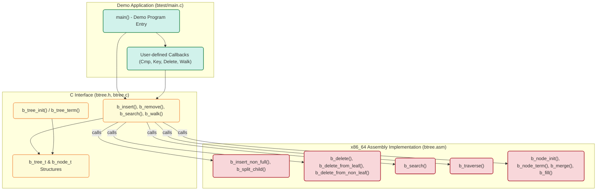

# Project Architecture

Understand how the core components of the BTree project fit together to deliver a high-performance, assembly-optimized BTree data structure accessible through a clean C interface. This page provides a visual and narrative breakdown of the system architecture, spotlighting the three foundational pieces: the Assembly BTree core, the C interface layer, and the demo application that ties everything together.

---

## Architecture Overview

At the heart of the BTree project is a finely tuned x86_64 Assembly implementation of the BTree algorithms, designed for speed and efficiency. This core is exposed and managed through a C interface, allowing Linux developers to interact with it using familiar C constructs. The demo application, written in C, showcases how to build, manipulate, and query the BTree using this interface.

### Key Components

- **Assembly BTree Core:** The engine implementing BTree operations such as insertion, deletion, search, and traversal entirely in x86_64 Assembly. This component ensures maximum performance with fine control over memory and CPU operations.
- **C Interface Layer:** A thin but powerful wrapper exposing the Assembly routines as callable C functions and data structures. It handles initialization, memory management, and provides user-defined callbacks for customizing behavior.
- **Demo Application:** A practical example demonstrating how to utilize the BTree C interface, including data insertion, deletion, searching, and tree walking with user callbacks.

---

## Architectural Visualization

---

## How the Components Work Together

1. **Demo Application Layer**: This is where the user interacts. Upon startup, it initializes the BTree using `b_tree_init()`, sets up user callbacks for comparisons, key extraction, deletion handling, and traversal. It generates random data, inserts it into the tree via `b_insert()`, walks the tree to display contents, performs removals with `b_remove()`, and validates searches.

2. **C Interface Layer**: This layer provides data structures (`b_tree_t` and `b_node_t`) abstracting the tree and its nodes, and defines function prototypes that manipulate these structures. The interface manages memory allocations for nodes, calls into the assembly core for operations, and invokes user-defined callbacks passed via initialization for customized comparison and key extraction logic.

3. **Assembly Core**: The assembly functions implement the heavy lifting — efficient insertion (`b_insert_non_full`, `b_split_child`), deletion (`b_delete` variants), searching (`b_search`), and traversal (`b_traverse`). It respects the tree's minimum degree parameter, manages node splits and merges, and carefully handles edge cases such as empty roots or rebalancing via borrowing keys from siblings.

---

## Data Flow and User Interaction

- The Demo starts by creating and initializing a BTree structure through the C interface.
- When data is inserted or removed, the C layer dispatches these requests to the optimized Assembly routines.
- Assembly code directly manipulates the BTree nodes and objects in memory for speed.
- User callbacks defined in the Demo (for comparison, key retrieval, deletion action) are called during tree operations, enabling flexible data types and behaviors.
- Tree traversal in Assembly invokes the provided callback for each stored object, allowing the demo to display or process tree contents.

---

## Practical Example

Consider the Demo app inserting a random floating-point number:

1. Calls `b_insert(tree, &d)` in C interface.
2. The `b_insert` function checks root fullness and delegates to `b_insert_non_full` or initiates root splitting.
3. The Assembly core places the new data in the correct node based on key comparisons using user callbacks.
4. If a node overflows, `b_split_child` happens, adjusting the tree structure.
5. Insertions happen rapidly due to tight Assembly loops and minimal overhead.
6. Later, when walking the tree, Assembly functions traverse nodes calling back into the Demo’s print function.

---

## Best Practices

- **Tuning Minimum Degree**: The `mindeg` parameter controls node capacity and balance; setting it appropriately affects performance and memory usage.
- **Write Efficient Callbacks**: User callbacks are called frequently; efficient implementations reduce total overhead.
- **Use Demo as Reference**: The demo app (`btest/main.c`) demonstrates safe and effective usage patterns including insertion, deletion, and traversal workflows.
- **Review Printf Sections for Debugging**: Assembly includes `printf` debugging statements (marked `BEGIN PRINTF`/`END PRINTF`) that can be enabled or disabled for troubleshooting.

---

## Troubleshooting

- **Tree Root is NULL:** Make sure to initialize the tree with `b_tree_init` before inserting.
- **Duplicate Keys:** Demo ensures no duplicates are inserted; custom keys must maintain uniqueness if needed.
- **Callback Crashes:** Verify callback function signatures and avoid side effects.
- **Memory Leaks:** Free the tree correctly using `b_tree_term` and `b_tree_free`.

---

## Next Steps

- Explore **Using the BTree C Interface** documentation to learn all available functions and their parameters.
- Review the **Compiling and Running the Demo** guide for hands-on practice.
- Learn about **Best Practices and Patterns** to optimize your use of the BTree in real projects.

---

For source code references, visit the project repository: [BTree on GitHub](https://github.com/KatoKode/BTree)

---