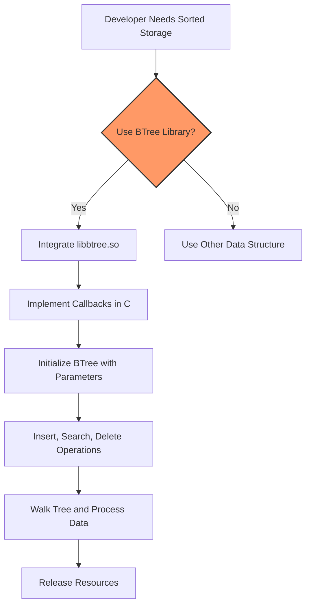

# Who Should Use This & Typical Use Cases

## Understanding the Target Audience

The BTree implementation in this project is specially crafted for **developers and engineers** working within **Linux environments** who engage with **low-level programming** using both **C and x86_64 Assembly language**. If your work involves manipulating complex data structures with an emphasis on performance, memory efficiency, and close-to-the-metal control, this BTree library is designed for you.

This solution fits professionals who:

- Develop **embedded or high-performance systems** where minimal overhead and maximum speed are crucial.
- Require a **stable, deterministic data structure** with fast insertion, deletion, and search capabilities.
- Build software components like **databases, caching layers, simulation engines, or indexing services**.
- Are comfortable working with **shared libraries** and integrating Assembly routines with C interfaces.

## Primary Use Cases

This BTree library excels in scenarios that demand high performance and efficient data management:

### 1. Integrating Efficient Tree Structures into Custom Databases

Use this BTree to manage large sorted datasets internally, enabling:

- Rapid key-based insertion and deletion without restructuring overhead seen in binary trees.
- Efficient range queries by traversing tree nodes.
- Low memory fragmentation due to controlled node allocations.

*Example:* Embedding the BTree in a custom Linux-based key-value store to manage sorted indexes with minimal latency.

### 2. Simulation and Real-Time Systems

Real-time applications such as event simulation or game engines can leverage this BTree to:

- Maintain ordered collections of events or objects sorted by priority or timestamp.
- Perform constant-time balancing during heavy insert/delete workloads.
- Integrate via the C interface while benefiting from optimized Assembly internals.

*Example:* A network packet scheduler maintaining queues ordered by sequence numbers or priority using the BTree.

### 3. Performance-Critical Data Retrieval

Applications needing predictable, high-speed data lookup, such as:

- Memory-mapped file systems or in-memory caches.
- Custom indexing algorithms where access time is critical.
- Systems working with sensor or telemetry data requiring sorted access.

*Example:* A monitoring tool storing sensor metrics in a BTree to enable fast threshold queries and updates.

### 4. Educational and Experimental Pursuits

For developers studying the intersection of Assembly optimization and data structures:

- Understanding low-level memory and CPU optimization techniques applied to classic trees.
- Exploring integration between Assembly and C for extensible, embeddable data structures.
- Customizing and experimenting by modifying callback functions and parameters.

*Example:* Modifying the demo program `btest` to customize insertion/delete counts and observe Assembly-level optimizations and callbacks.

## Why Choose This BTree Implementation?

- **Hand-optimized Assembly Core:** Combines the speed of Assembly with the accessibility of C.
- **Fully Customizable Callbacks:** Insert your own comparison, deletion, and key extraction logic.
- **Lightweight Shared Library:** Easily embeddable into existing Linux projects.
- **Demo and Build Scripts Provided:** Quick build and test cycles with `btree_make.sh` and `go_btest.sh` scripts.

## Getting the Most Out of This Library

- Familiarize yourself with the **callback mechanism** to tailor the BTree behavior to your data types and requirements.
- Leverage the demo program for insights by altering parameters such as `DATA_COUNT` and `DELETE_COUNT` in `main.h`.
- Use the provided makefiles for seamless compilation and linking of your projects with the BTree shared library.

## Common Pitfalls & Tips

- Ensure **data uniqueness** when inserting — the demo program includes checks to avoid duplicates but real applications should handle this carefully.
- **Avoid negative or out-of-bound values** for demo parameters; the program does not validate these inputs, which may cause unexpected behavior.
- Take advantage of the callback hooks for debugging outputs and tailor them for logging or tracing.

---

## Visualizing Usage Workflow

## Summary

This page targets Linux developers proficient in C and Assembly who seek reliable, embeddable, and high-performance BTree data structures. The described use cases range from database indexing to real-time event management, highlighting the library's applicability in critical software systems. Developers are guided to leverage callbacks and build setups for efficient integration and customization.

---

## Next Steps

After assessing whether this BTree implementation fits your project needs, consider exploring:

- [What is the BTree Project?](./product-summary) for background and value proposition.
- [Key Features & Capabilities](./core-features) to understand available operations and their benefits.
- [Using the BTree C Interface](../guides/core-workflows/using-btree-c-interface) to learn detailed integration steps.
- [Building & Running the Demo](../architecture-quickstart/quickstart-demo) for hands-on experimentation.

Armed with this knowledge, you can integrate this high-performance BTree into your applications with confidence.

---

## References

- [GitHub Repository](https://github.com/KatoKode/BTree) — Access source code, issues, and further documentation.
- [GeeksforGeeks: Delete Operation in B-Tree](https://www.geeksforgeeks.org/delete-operation-in-b-tree/?ref=lbp) — Background reference implementation inspiration.

---

<Tip>
This library's unique combination of Assembly optimization and C accessibility ensures you can achieve exceptional performance without sacrificing usability. Experiment with callbacks and demo parameters to fully harness its potential.
</Tip>

<Warning>
The demo program does not validate certain parameters—exercise caution when modifying `DATA_COUNT` and `DELETE_COUNT`.
</Warning>

<Check>
Ensure your development environment meets prerequisites and that you understand the callback interface to avoid integration pitfalls.
</Check>
