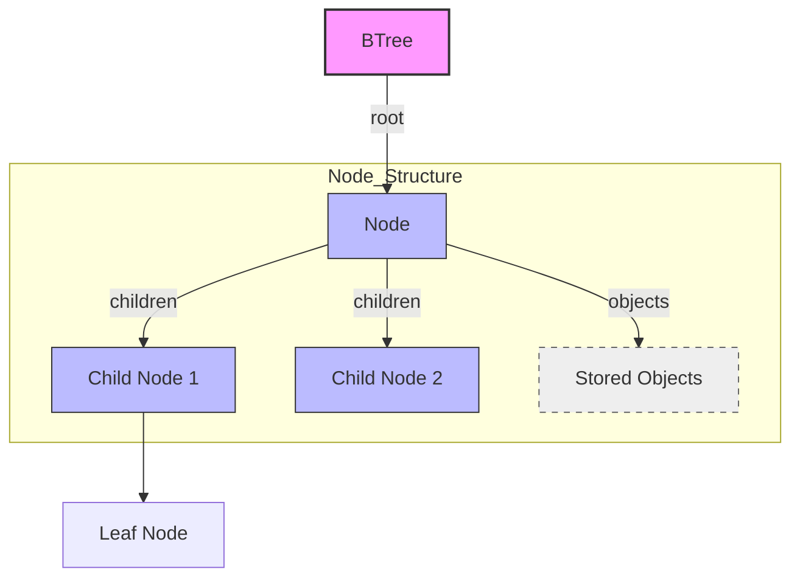

# Core Concepts & Terminology

Welcome to the foundational guide on the essential principles and terminology behind the BTree Project. This page equips you with the critical understanding needed to effectively work with the BTree library, whether you are inserting data, searching for keys, or customizing callbacks.

---

## What Is a BTree?

A BTree is a type of multiway search tree optimized for systems that read and write large blocks of data, commonly used in databases and filesystems. Unlike traditional binary trees, a BTree node can have multiple children and store multiple keys, enabling shallower and broader tree shapes for improved performance.

### Why Does This Matter?

Users leveraging the BTree Project benefit from rapid data insertion, deletion, and search, achieved through minimized disk accesses and balanced tree shapes. The design fits perfectly for high-performance Linux applications written in C, where efficient data management is crucial.

## Multiway Trees vs Binary Trees

- **Binary Tree:** Each node has at most two children.
- **Multiway Tree (BTree):** Each node can have many children, determined by the tree's minimum degree parameter.

This distinction is vital because it means BTrees reduce the height of the tree significantly, enabling faster data operations through fewer node visits.

## Key Terminology Explained

Understanding these terms ensures you interpret the BTree API and concepts correctly:

| Term           | Description |
|----------------|-------------|
| **Node**       | The fundamental unit holding keys and child pointers.
| **Root Node**  | The topmost node of the BTree.
| **Leaf Node**  | Nodes without children, at the bottom of the tree.
| **Object**     | Data element stored inside the BTree nodes.
| **Minimum Degree (t)** | Defines the lower and upper bounds on the number of keys in a node. Each node (except root) holds at least t-1 keys and can hold at most 2t-1 keys.
| **Children**   | Pointers to subtrees, one more than the number of keys.
| **Key Comparison Callback** | User-supplied function that determines how keys and objects are compared.
| **Deletion Callback** | User-supplied function invoked whenever an object is removed.
| **Key Getter Callback** | Function to extract keys from objects for searching.

## BTree Internal Structure

Each BTree node is composed of:

- An array of objects (keys/data).
- An array of child pointers (if not a leaf).
- Metadata including the count of objects and a flag indicating if it’s a leaf.

The overall BTree structure contains:

- The minimum degree parameter.
- The size of objects stored.
- Pointer callbacks for comparing, deleting, and retrieving keys.
- The root node pointer.

<AccordionGroup title="Core BTree Terms">  
<Accordion title="Node and Root">  
A node contains multiple data objects and pointers to children nodes. The root node is the top of the tree and the entry point to all operations.  
</Accordion>  
<Accordion title="Leaf Node">  
A leaf node is a node without any children, holding only data elements. Searches terminate at leaf nodes if key is not found earlier.  
</Accordion>  
<Accordion title="Minimum Degree (t)">  
Minimum degree determines the allowed size range in nodes, balancing tree height and width, impacting speed of access.  
</Accordion>  
<Accordion title="Callbacks">  
User-defined functions for comparing keys, deleting objects, and extracting keys enable flexible data handling and integration with your data structures.  
</Accordion>  
</AccordionGroup>

## Why Are These Concepts Important?

Grasping these fundamentals helps you:

- Design the BTree with an appropriate minimum degree suited to your data size and access patterns.
- Define your comparison and key retrieval logic correctly so the tree can maintain order and perform accurate searches.
- Understand the behaviors of insertion, deletion, and traversal as they navigate and modify the multiway node structure.

## Practical Example: How Data Is Stored

Imagine storing floating-point sensor readings associated with timestamps.

- Each reading is an _object_ stored in a node.
- The BTree uses your `o_cmp_cb` callback to compare full objects during insertion.
- For searching by timestamp key, it uses your `k_cmp_cb` and `k_get_cb` to extract and compare keys efficiently.

This flexibility enables the BTree to be the engine behind complex data structures while you maintain control over how your data is managed.

## Diagram: BTree Node Structure Overview

## Tips for Efficient Use

- **Choose your minimum degree wisely:** Larger degrees reduce tree height but increase node size.
- **Implement callbacks carefully:** Your comparison and key-getting callbacks directly affect correctness and performance.
- **Manage memory:** Objects stored inside nodes must be compatible with the declared size and callback interfaces.

## Common Pitfalls

- Forgetting to handle keys and objects consistently in callbacks can corrupt tree ordering.
- Setting an inappropriate minimum degree can degrade performance or increase memory usage unnecessarily.
- Misunderstanding leaf versus internal nodes leads to incorrect insertions or deletions.

## Next Steps

After mastering these concepts, you’ll be ready to explore:

- [Key Features & Capabilities](/overview/intro-value/core-features) to see how these core concepts turn into powerful operations.
- [Using the BTree C Interface](/guides/core-workflows/using-btree-c-interface) to implement BTrees in your own code.
- [Who Should Use This & Typical Use Cases](/overview/intro-value/audience-usecases) to identify where BTrees thrive in real applications.

<Tip>
Always start with clear definitions of your object types and tailor the callback functions accordingly to unlock maximum BTree efficiency and correctness.
</Tip>

---

Source code and further reading can be found at the [BTree GitHub Repository](https://github.com/KatoKode/BTree).

